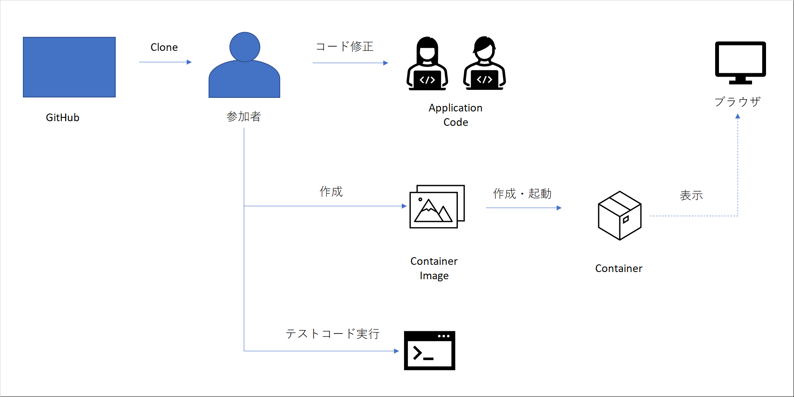

# Python×DjangoのWEBサイト作成&テスト自動化を通して実践スキルを学ぼう！

## 事前準備
- VSCodeインストール
- Dockerインストール
- Gitインストール、GitHubアカウントの作成

## 今回の流れ（画面作成 ～ テスト）
Djangoフレームワークを用いて、商品の登録や検索を行うことの出来る画面を作成。その後、テストコードを作成し実際に作成した画面に対するテストまで実施します。

以下の4画面の作成と、そのテスト実施を予定しています。
- 商品情報検索画面
- 商品情報詳細画面
- 商品情報登録画面
- 商品情報更新画面
  
→ここで実際に動かしてみせるとゴールが分かりやすいか？

## 手順
全体手順としては以下の流れで進めます。

※暫定の絵です※

- デモアプリクローン
- アプリケーションコード修正
- デモアプリの起動・動作確認
- テストコード作成
- テスト実施
- 後片付け
