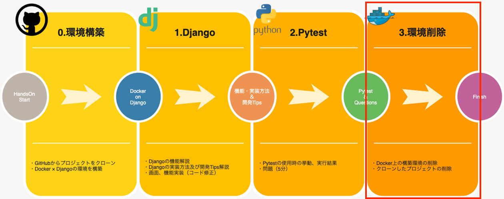

# local環境のCleanup
当手順では以下の赤枠部分を実施します。


## コンテナの停止
次のコマンドを実行し、コンテナの状態を確認します。
```sh
docker ps
# CONTAINER ID   IMAGE                      COMMAND                  CREATED         STATUS          PORTS                                       NAMES
# 880cca39ce25   meetup_web                 "python3 manage.py r…"   3 minutes ago   Up 3 minutes    0.0.0.0:8000->8000/tcp, :::8000->8000/tcp   meetup_web_1
```
上記で確認できた`CONTAINER ID`を次のコマンドで利用し、コンテナを停止します。
```sh
docker stop [CONTAINER ID]
```
## イメージの削除
次のコマンドを実行し、作成したコンテナイメージを確認します。
```sh
docker images
# REPOSITORY                 TAG              IMAGE ID       CREATED          SIZE
# meetup_web                 latest           3fb5e3117d67   10 minutes ago   382MB
```

上記で確認できた`IMAGE ID`を利用して、ビルドされたイメージを削除します。
```sh
docker rmi -f [IMAGE ID]
```
次のようなメッセージが確認できたら、イメージが正常に削除出来ています。
> Untagged: meetup_web...

## フォルダの削除
最後にフォルダを削除します。

### Macの場合
```sh
# 一つ上の階層に移動
cd ../
# xxxxxxxxxxxフォルダが存在しているかを確認
ls
# xxxxxxxxxxxフォルダが存在している場合、下記コマンドを実行しフォルダを削除
rm -rf xxxxxxxxx
```
### Windowsの場合

```sh
# 一つ上の階層に移動
cd ../
# xxxxxxxxxxxフォルダが存在しているかを確認
dir
# xxxxxxxxxxxフォルダが存在している場合、下記コマンドを実行しフォルダを削除
rd /s /q xxxxxxxxxx
# PowerShellをご使用の方はこちらのコマンドをご使用下さい
Remove-Item xxxxxxxxxx -Recurse -Force
```

以上。