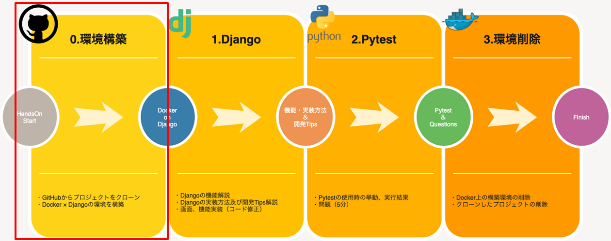
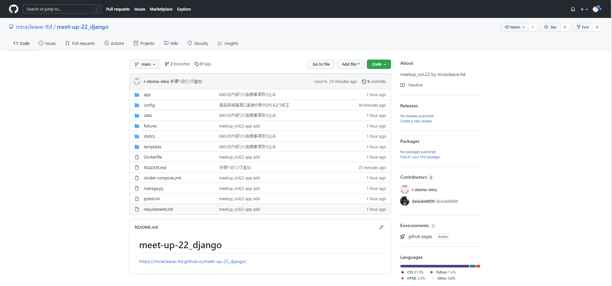
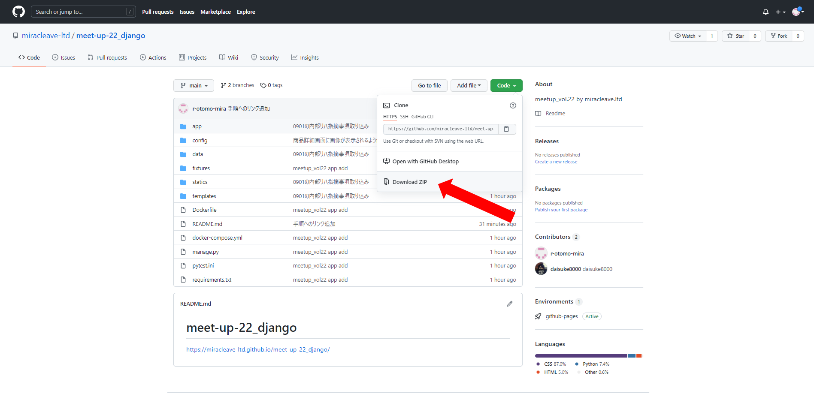
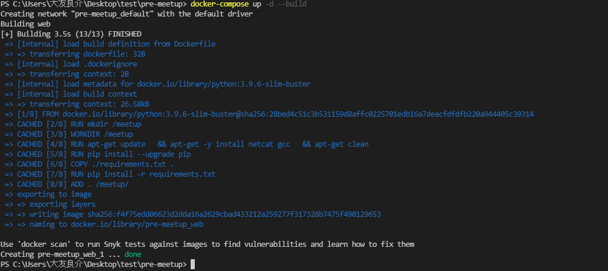

# デモアプリダウンロード
当手順では以下の赤枠部分を実施します。



## Githubリポジトリ表示
以下リンクよりデモアプリのあるGithubリポジトリにアクセスします。
URL:https://github.com/miracleave-ltd/meet-up-22_django




## ソースコードダウンロード
Codeボタンより、Zipファイルをダウンロードします。




## ソースコード展開

ダウンロードしたZipファイルを任意のフォルダに展開してください。

※次の手順を進めるに当たり、展開されたフォルダをVSCodeで開くようお願いします。

## サイトを立ち上げてみる

デモアプリを修正していない状態で、一度サイトを起動してみましょう。

### Dockerの起動

コマンドをVSCodeのターミナル上から実施し、Dockerの起動を行います。

以下イメージのように `Creating <Dockerコンテナ名> ... done ` と表示されると成功です。

```
docker-compose up -d --build
```




### スーパーユーザーの作成

以下コマンドを実施し、管理サイトにて使用するユーザー情報を作成します。

```
docker-compose run web python manage.py createsuperuser
```

設定する値はそれぞれ以下の通りです。
- ユーザー名：admin
- メールアドレス：未設定（そのままEnter）
- パスワード：任意の値（単純すぎるものは警告が出ます）


上記までの手順で、ブラウザに以下URLを入力することで画面を参照することが出来ます。

http://localhost:8000
