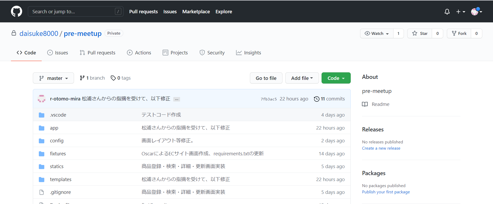
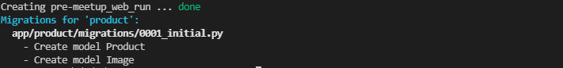

# デモアプリクローン
当手順では以下の赤枠部分を実施します。

※暫定の絵です※


## Githubリポジトリ表示
以下リンクよりデモアプリのあるGithubリポジトリにアクセスします。
URL:https://github.com/miracleave-ltd/meet-up-22-django(仮)


※正式Git用意され次第キャプチャ差し替え※


## リポジトリコピー
Forkボタンを押下します。

※正式Git用意され次第キャプチャ差し替え※


※Forkボタン押下後、Githubにログインしている方は自動で自身のリポジトリに遷移します。

## クローン用URL取得

自身のリポジトリにコピーされたアプリのURLをコピーします。

※正式Git用意され次第キャプチャ差し替え※


## アプリクローン

以下操作をコマンドプロンプトにて行い、GitHubよりアプリを取得します。

例：デスクトップにクローンする場合

```
cd ~/Desktop
```

アプリをクローンします。GitHubよりコピーしたURLを使用してください。

```
git clone [コピーしたURL]
```

最終行に`done. `が表示されれば完了です。

>Cloning into 'pre-meetup'...
>
>remote: Enumerating objects: 162, done.
>
>remote: Counting objects: 100% (162/162), done.
>
>remote: Compressing objects: 100% (110/110), done.
>
>remote: Total 162 (delta 61), reused 141 (delta 40), pack-reused 0
>
>Receiving objects: 100% (162/162), 55.28 KiB | 243.00 KiB/s, done.
>
>Resolving deltas: 100% (61/61), done.


次の手順を進めるに当たり、クローン後に作成されたフォルダをVSCodeで開くようお願いします。

## サイトを立ち上げてみる

デモアプリを修正していない状態で、一度サイトを起動してみましょう。

### Dockerの起動

以下コマンドを実施し、Dockerの起動を行います。

以下イメージのように `Creating <Dockerコンテナ名> ... done ` と表示されると成功です。

```
docker-compose up -d --build
```


### マイグレーションを実施

以下のコマンドを実行し、モデルファイルに記載された内容を元にテーブルの作成を実施します。

(補足)

VSCodeのターミナル上から実施してください。

クローンしたデモアプリのルートフォルダに移動した状態で実施してください。

```
docker-compose run web python manage.py makemigrations
```

makemigrations実行後、以下のようなメッセージが表示されると成功です。



```
docker-compose run web python manage.py migrate
```

migrate実行後、以下のようなメッセージが表示されると成功です。


### スーパーユーザーの作成

以下コマンドを実施し、作成したWEBサイトにて使用するユーザー情報を作成します。

```
docker-compose run web python manage.py createsuperuser
```

設定する値はそれぞれ以下の通りとしてください。
- ユーザー名：任意の名称
- メールアドレス：未設定（そのままEnter）
- パスワード：任意の値（単純すぎるものは警告が出ます）


上記までの手順で、ブラウザに以下URLを入力することで画面を参照することが出来ます。

http://localhost:8000
