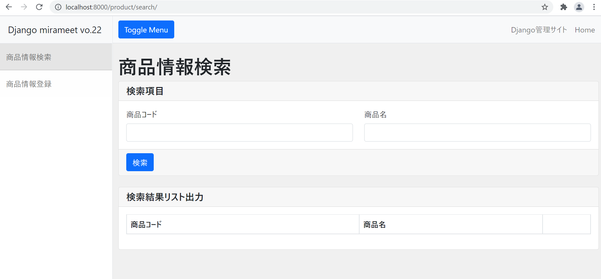

# アプリケーションコード修正（商品情報検索画面）
当手順では以下赤枠部分の内、商品情報検索画面の入力フォームにCSSを適用します。

CSS適用に際して、widget_tweaksプラグインを使用しますので、その説明も併せて行います。


## 当画面に関連するソースファイル

- app\product\filter\product_search_filter.py
- app\product\views\product_search_view.py
- app\product\urls.py
- templates\product\product_search.html **←修正対象**
- templates\product\component\product_field.html **←修正対象**


## Template（HTML）の修正
各フォーム項目表示用コンポーネントを作成し、そのコンポーネントを検索画面に表示されるよう修正します。

なお、コンポーネント内でwidget_tweaksを使用します。

>templates\product\component\product_field.html

```html


<label for={{ field.id_for_label }} class="form-label">
    {{ field.label }}
</label>


    

    



    <div id="{{ field.id_for_label }}" class="invalid-feedback">{{ err_msg }}</div>

```

- ポイント
  
  widget_tweaksプラグインを読み込むことで、該当HTMLで使用することが可能です。

  以下のようにrender_fieldタグで表示したい項目を囲み、class指定をしてあげることでHTMLを書くようにCSSを適用することが出来ます。


>templates\product\product_search.html - 15Line ~ 17Line

変更前

```html
    <div class="card-body">
        {{ filter.form.as_p }}
    </div>
```

変更後

```html
    <div class="card-body">
        <div class="row">
            <div class="col-6">
                <div class="form-group">
                    
                </div>
            </div>
            <div class="col-6">
                <div class="form-group">
                    
                </div>
            </div>
        </div>
    </div>
```

- ポイント
  
  フォームなど、繰り返し出現する記載については上記のように別パーツ化をして

  includeタグで呼び出すことによりソースの記述量を減らすことが可能です。

  with xxxx=~~ と記載することで、インクルードするHTMLへパラメータを渡すことも出来ます。


## 画面確認
以下URLをブラウザにて入力し画面を表示します。

http://localhost:7777

商品情報検索ボタンを押下してみてください。

※ 最終差し替え予定 ※


検索画面が表示されレイアウトがイメージの通り変更されていれば成功です。




## データの登録
検索画面を表示することが出来ましたが、肝心のデータが0件の為、試しに1件データを登録します。

画面右上のDjango管理サイトというリンクを押下してください。


以下のような画面が表示される為、2ページ目の手順にて作成したスーパーユーザーの情報を入力しログインします。


管理サイトという画面が表示される為、Products、Imagesのリンクを押下しそれぞれデータを作成します。任意の値で問題ありません。なお、手頃な画像をお持ちで無い方はappフォルダと同階層にdataというフォルダを用意しておりますので、そちらに格納された画像を使用してください。


データ登録後、作成した検索画面にて検索を行うと、登録した商品情報が表示されることを確認できます。


