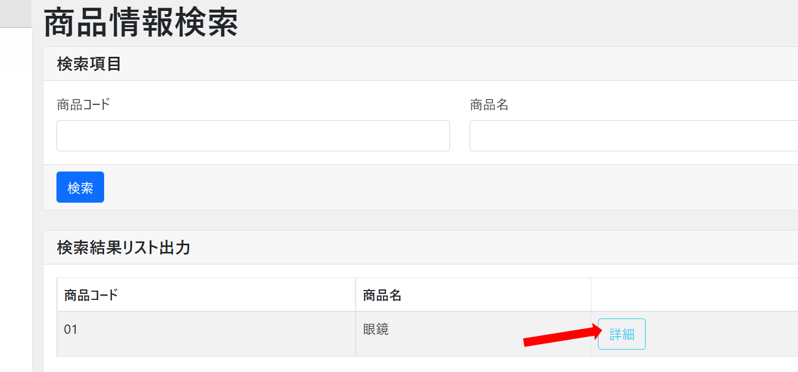
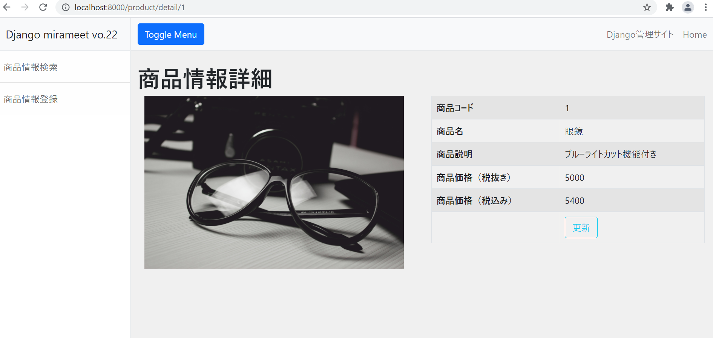

# アプリケーションコード修正（商品情報詳細画面）
商品情報詳細画面へ遷移出来るようURL設定を修正し、商品情報詳細画面に対するView機能を実装します。


## 注意事項
商品情報検索画面作成時に追加／修正したファイルはそのままとしてください。


## 当画面に関連するソースファイル

- app\product\views\product_detail_view.py **←修正対象**
- app\product\urls.py
- templates\product\product_detail.html **←修正対象**
- templates\product\product_search.html **←修正対象**


## Template（HTML）の修正
templates\product\product_search.htmlの51Line目付近へ、詳細ボタン押下時に呼び出されるURL定義を追記します。

変更前

```html
<a href="#" type="button" class="btn btn-outline-info" name="detail">詳細</a>
```

変更後

```html
<a href="" type="button" class="btn btn-outline-info" name="detail">詳細</a>
```

※ここまでの手順で検索画面にて、検索ボタンを押下するとどうなるか見てみましょう。


## viewの修正
app\product\views\product_detail_view.py に詳細ボタン押下時の処理を実装します。


```python
from app.product.models.product import Product
from django.views.generic import DetailView


class ProductDetailView(DetailView):
    model = Product
    template_name = 'product/product_detail.html'
```


## urls.pyの修正
app\product\urls.py に詳細画面用のviewをインポートし

urlpatternsに詳細画面へ遷移する為のURL文字列とインポートしたviewを設定します。

```python
from django.urls import path
from app.product.views.product_search_view import ProductSearchListView
# 追記
from app.product.views.product_detail_view import ProductDetailView
from django.views.generic import TemplateView

app_name = 'product'

urlpatterns = [
    path('', TemplateView.as_view(template_name='product/product_top.html'), name='top'),
    path('search/', ProductSearchListView.as_view(), name='product_search'),
    # 追記
    path('detail/<int:pk>', ProductDetailView.as_view(), name='product_detail'),
]
```

- ポイント
  
  WEBサイトの多くは

  - DBからの情報を絞り込んで検索結果を表示する
  - 検索結果の内、単一の情報の詳細内容を表示する
  - 画面に入力された内容を元にDBへ情報を登録・更新する
  
  という機能を持っています。
  
  上記のような定型的な処理について、同じようなコードを書かなくても済むようあらかじめDjangoに処理が定義されています。
  
  その処理のことを汎用ビューと呼び、関数で定義されていれば「関数ベース汎用ビュー」、クラスで定義されていれば「クラスベース汎用ビュー」と呼びます。

  クラスベース汎用ビューの内、何点かピックアップして紹介します。
  
- DetailView

    個別詳細ページ実装時に使用する汎用ビューとなります。
    modelに定義されたテーブルより、URLに指定されたプライマリーキーを元に絞り込まれたレコードを1件取得します。

<実装例>

> views.py

```python
    from django.views.generic import DetailView
    from mymodel.model import MyModel


    class MyDetailView(DetailView):
        model = MyModel
```

> urls.py

```python
    urlpatterns = [
        path('<int:pk>', MyDetailView.as_view()),
    ]
```
  
  - CreateView／UpdateView
  
    CreateViewは、新たにレコード追加するフォームを定義することが出来るビューとなります。

    UpdateViewは、すでに存在するデータを更新するフォームを定義することが出来るビューとなります。
    
    ```form_valid``` , ```form_invalid```というメソッドが定義されているので、エラーの有無によって独自の処理を実施することが可能です。


<CreateViewの実装例>

> views.py

```python
from django.views.generic import CreateView
from mymodel.model import MyModel
from forms import MyModelForm

class MyCreateView(CreateView):
    model = MyModel
    form_class = MyModelForm

    def form_valid(self, form):
        ''' 入力内容チェックにエラーがない場合 '''
        messages.success(self.request, "保存しました")
        return super().form_valid(form)

    def form_invalid(self, form):
        ''' 入力内容チェックにエラーがある場合 '''
        message.warning(self.request, "保存できませんでした")
        return super().form_invalid(form)
```

> forms.py

```python
from django import forms
from mymodel.model import MyModel


class MyModelForm(forms.ModelForm):

    class Meta:
        model = MyModel
        exclude = ['create_at', 'update_at', 'create_user', 'update_user',]
```

> urls.py

```python
urlpatterns = [
    path('create/', MyCreateView.as_view()),
]
```

## 画面確認
以下URLをブラウザへ入力し画面を表示します。

http://localhost:8000

商品情報検索結果に表示された詳細ボタンを押下すると、作成した商品情報詳細画面へ遷移するようになります。



