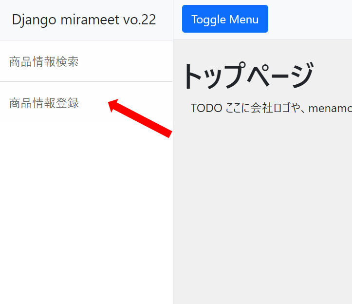

# アプリケーションコード修正（商品情報登録画面）
商品情報登録画面について、画像アップロードが出来るように修正します。


## 注意事項
商品情報詳細画面作成時と同様、これまで作成／修正したファイルはそのまま利用します。


## 当画面に関連するソースファイル

- app\product\views\product_create_view.py **←修正対象**
- app\product\urls.py
- templates\product\product_create.html
- templates\product\component\product_field_create.html


## viewの修正
app\product\views\product_create_view.py に画像をアップロードする為の処理を追加します。

```python
class CreateProductView(CreateView):

    # 省略

    def form_valid(self, form):
        obj = form.save()
        image = Image(
            product=obj,
            image=form.cleaned_data['image'],
        )
        image.save()
        return super().form_valid(form)
```

- ポイント
  
  form_validメソッドにて、Imageモデルの追加を行っています。

  objという変数は、画面で登録されたProductモデルのレコードとなります。

  ImageモデルにはProductモデルへの外部キーカラムを設定している為、

  ```python
  product=obj,
  ```
  と指定し、formに設定された画像情報をimageカラムに設定することでアップロードが実施可能です。

  ```python
  image=form.cleaned_data['image'],
  ```
  アップロードされたファイルは、config\settings.pyのMEDIA_ROOTに設定されたパス配下に
  
  ImageモデルのImageFieldのupload_toに指定されたフォルダ（指定無い場合はMEDIA_ROOT直下）が作成されその中に配置されます。

  今回の設定の場合は、media\image というフォルダに画像が配置されます。


## urls.pyの修正

config\urls.py の最下行へ、アップロードされたファイルにURLアクセスする為に必要な設定を追記します。

当設定を加えることで、アップロードした画像を商品情報詳細画面にて表示することが可能です。


```python
if settings.DEBUG:
    urlpatterns += staticfiles_urlpatterns()
    urlpatterns += static(settings.MEDIA_URL, document_root=settings.MEDIA_ROOT)
```

## 画面確認
以下URLをブラウザへ入力し画面を表示します。

http://localhost:8000

商品情報登録画面にて画像のアップロードが出来るようになりました。



