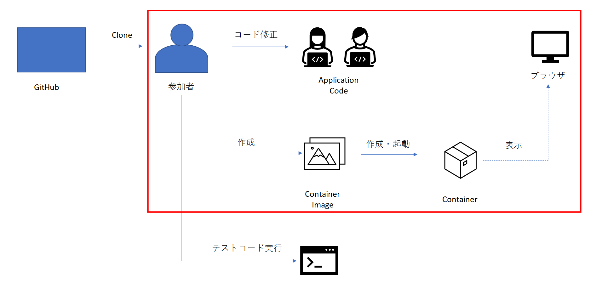

# アプリケーションコード修正（商品情報更新画面）
商品情報更新画面を作成します。

当画面については、ご自身で実装していただきます。




## ヒント
- UpdateViewというクラスベース汎用ビュー機能を使用して実装します。 ← 5ページ目を参照
- 処理成功後に遷移する画面のURLを設定する必要があります。以下の関数を作成したviewファイルに実装しましょう。
  
  ```python
    def get_success_url(self):
        return reverse('product:product_detail', kwargs={'pk': self.kwargs['pk']})
  ```

- 商品情報詳細画面に更新ボタンを用意していますので、そのボタンから遷移するようにURL設定を行いましょう。
- 画面レイアウトも綺麗に対応しましょう。 ← 4ページ目を参照
- 出来た方は、商品登録画面のソースを参考に画像の更新についても実装してみましょう。
