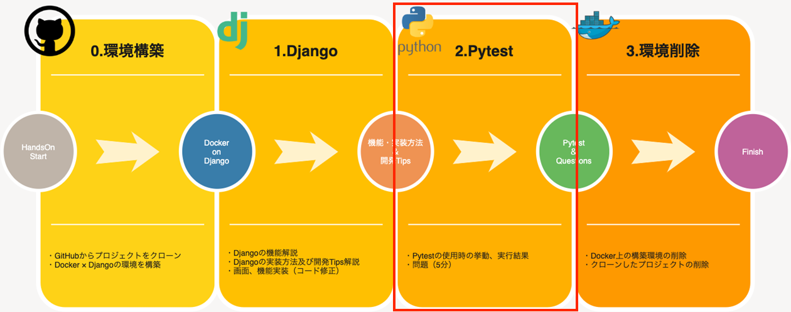
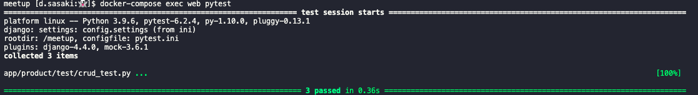
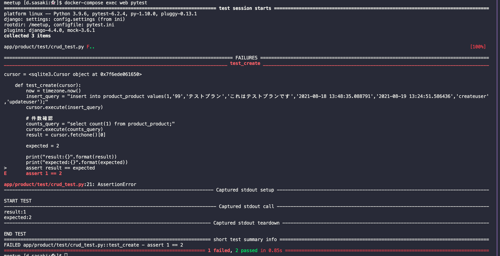

# Pytest

当手順では以下の赤枠部分を実施します。



この手順ではPytestを実行させたときにどんな動きをするのか。また、失敗した際にどんな内容で表示されるのかを確認したいと思います。
なお、ここで確認できた内容を踏まえて、次のセクションではテストに関する簡単な問題を出題します。

問題の回答についても用意しておりますので、ぜひ問題にトライしてみましょう！

**今回用意したテストファイル**
- `app/product/test/conftest.py`<br>
pytestでテスト実行する際のDBアクセス設定を共通部品として記述しています。
- `app/product/test/crud_test.py`<br>
データのCreate, Read, Updateのテストを記述しています。
- `app/product/test/views_test.py`<br>
Viewに対しテストコードを記述する為、pytest-djangoという拡張機能を使用します。<br>
・正しいtemplateを使用しているか<br>
・正しいステータスコードが返却されているか<br>
についてのテストを実施します。

## Pytestの挙動
Pytestはターミナル上で以下のコマンドを実行すると、自動でテストコードを感知し実行してくれます。
```sh
# プロジェクト配下ですべてのテストを実行するとき
pytest .
```
```sh
# テストケースを指定して実行したいとき
pytest app/product/tests.py
```

### 【テスト成功時】
成功となった際には以下のようにターミナルへ出力され、実行したテストファイルやメソッドの数、テストの所要時間などが確認出来ます。



### 【テスト失敗時】
テストに失敗してしまった際にも同様にターミナルへ出力されますが、
以下のように**どこの箇所**で**どんなエラー**が発生しているかを教えてくれます！



上記の画像では、
- 「test_create」 関数で
- 「assert result == expected」の箇所で
- 「AssertionError」のエラー（例外）が発生している
- 「１つがfailed(失敗)、２つがパス（成功）している」

ということが分かります。

このように出力される結果が容易にテスト結果を把握できます。
